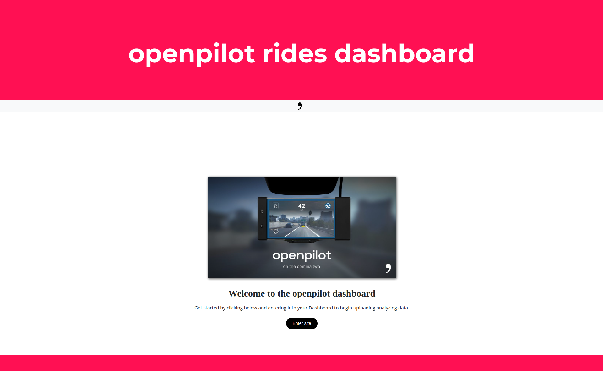
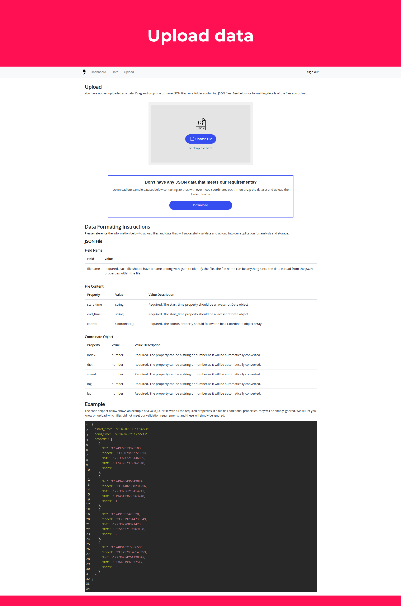
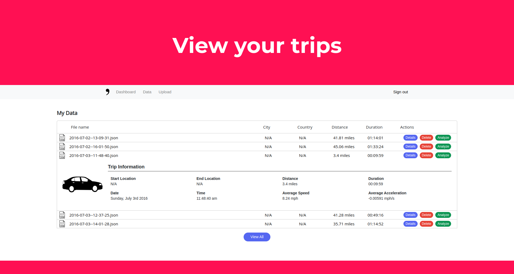
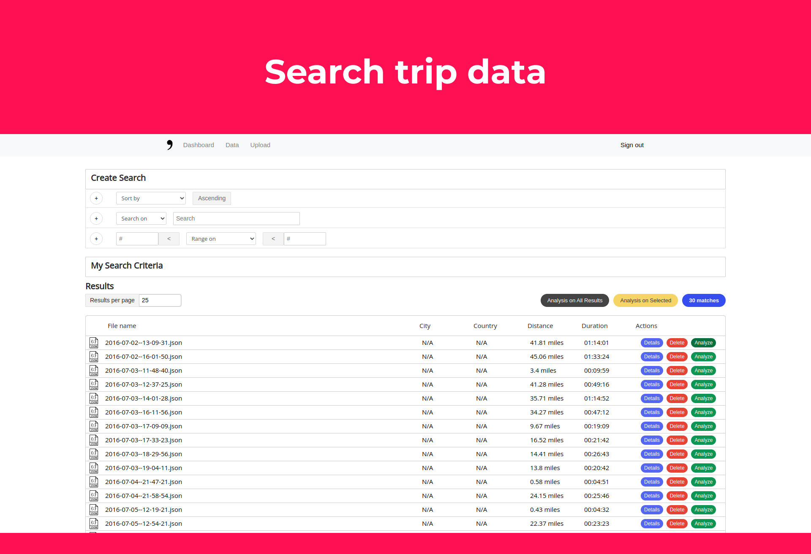
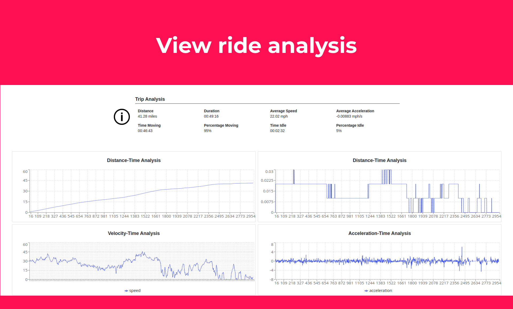

# Self-driving rides dashboard



___

## About

A dashboard for viewing and analyzing your rides using the Comma.ai self-driving car navigator. Manage your data in JSON and ZIP files, view your trips in tabular format, search and query trips with advanced parameters, and analyze specific trips with a Google Maps route viewer and advanced aggregate analysis.

Try [openpilot.netlify.app](https://openpilot.netlify.app)

### Features 

1. Upload data
2. View trips
3. Search trips
4. View ride analysis 









___

## Demo

1. Try `Live demo`
2. Try `Local demo`


### 1 | Live

Try [openpilot.netlify.app](https://openpilot.netlify.app)


### 2 | Local

To try it locally, clone the repository, install the `package.json` and then head over to [Google Maps API](https://developers.google.com/maps) and generate an API and save it in a file called `.env` at the top level of the directory.
```

# .env
REACT_APP_GOOGLE_API_KEY=[YOUR GOOGLE MAPS API KEY, remove brackets]
```

```

git clone https://github.com/eduardocgarza/openpilot-live
cd openpilot-live
yarn install
yarn start
```
